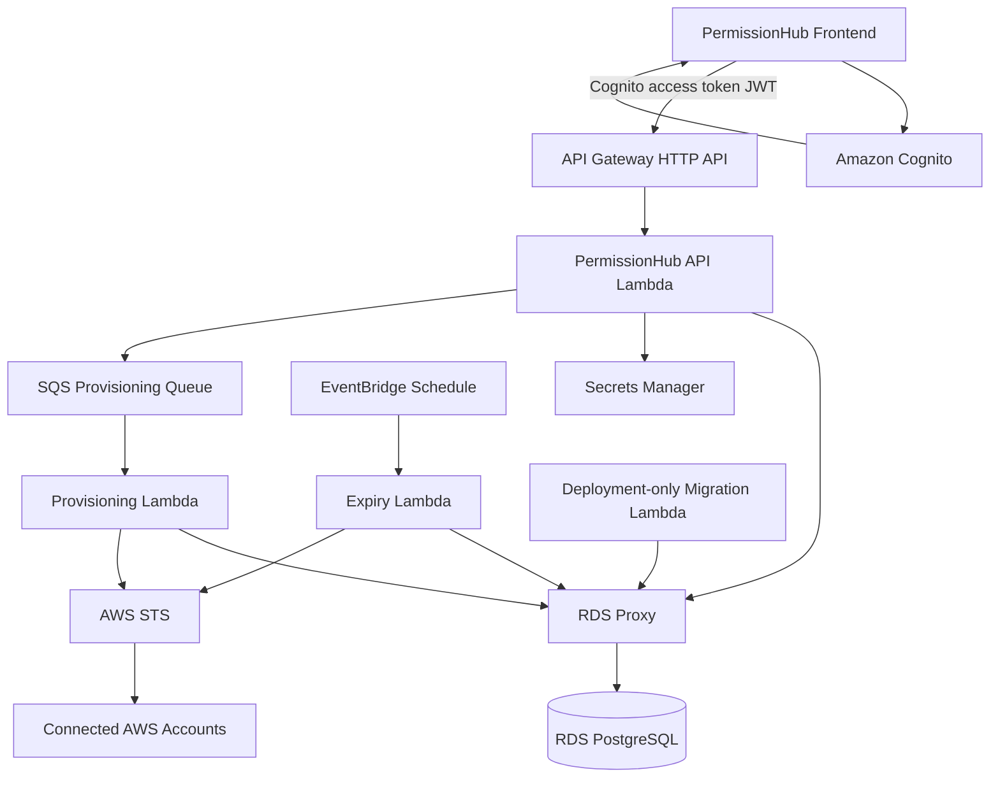

# PermissionHub Terraform

This directory defines the future AWS backend infrastructure for PermissionHub using API Gateway HTTP API, Lambda, Cognito, RDS PostgreSQL, RDS Proxy, SQS, EventBridge and CloudWatch.

This is infrastructure preparation only. The current local frontend/backend application runtime is not migrated to Lambda in this pass, and the existing local Docker/PostgreSQL/Redis development workflow remains unchanged.

## Architecture



## Design assumptions

- API Gateway validates Cognito access-token JWTs before protected API routes invoke Lambda.
- `GET /health` is public and must return only simple service health.
- Protected routes use `ANY /` and `ANY /{proxy+}` so the existing Express/router application can later be adapted behind one Lambda handler.
- Cognito answers “who is the user?” PermissionHub database RBAC still answers “what can this user do?”
- Existing PermissionHub tenant/account/approval/provisioning authorization remains an application concern.
- Provisioning should move from long synchronous API calls to SQS + Provisioning Lambda.
- Temporary access expiry should run through EventBridge + Expiry Lambda when application support is ready.
- Prisma and the Express runtime still need a future Lambda adaptation task. RDS Proxy is included to reduce database connection pressure.

## Folder structure

- `bootstrap/` creates encrypted S3 remote state and DynamoDB locking.
- `modules/networking` creates VPC, public subnets, private Lambda/app subnets and private DB subnets.
- `modules/security` creates Lambda, RDS Proxy, RDS and VPC endpoint security groups.
- `modules/cognito` creates a user pool, SPA app client, optional domain and optional future groups.
- `modules/api_gateway` creates HTTP API, JWT authorizer, Lambda proxy integration, public health route and protected proxy routes.
- `modules/lambda_api` creates the API Lambda and least-privilege execution role.
- `modules/lambda_provisioning` creates the SQS-triggered provisioning Lambda.
- `modules/lambda_expiry` creates the EventBridge-triggered expiry Lambda; the schedule is disabled by default.
- `modules/lambda_migration` creates a deployment-only migration Lambda with no API or schedule trigger.
- `modules/rds` creates private PostgreSQL 16-compatible RDS and DB credentials secret.
- `modules/rds_proxy` creates RDS Proxy using the DB secret.
- `modules/queues` creates provisioning SQS queue and DLQ.
- `modules/secrets` creates stable application secrets, including the PermissionHub credential encryption key.
- `modules/monitoring` creates lightweight API, Lambda, SQS and RDS alarms.

## Authentication and authorization

Cognito infrastructure is prepared, but the frontend and backend are not yet changed to use it.

Future flow:

1. React SPA redirects to Cognito hosted UI or a configured IdP.
2. Cognito returns tokens to the frontend.
3. The frontend calls API Gateway with the Cognito access token.
4. API Gateway JWT authorizer validates issuer and audience.
5. Lambda receives JWT claims in the API Gateway event.
6. Backend maps claims such as `sub`, `email` and `cognito:groups` into PermissionHub users.
7. PermissionHub RBAC/database scopes enforce tenant/account permissions.

Do not treat Cognito groups as a replacement for account-scoped PermissionHub authorization.

## Lambda artifacts

Terraform consumes immutable S3 artifact references:

- `lambda_artifact_bucket`
- `api_lambda_artifact_key`
- `provisioning_lambda_artifact_key`
- `expiry_lambda_artifact_key`
- `migration_lambda_artifact_key`

CI is responsible for building and uploading artifacts such as:

```text
permissionhub-api-<git-sha>.zip
permissionhub-provisioning-<git-sha>.zip
permissionhub-expiry-<git-sha>.zip
permissionhub-db-migration-<git-sha>.zip
```

The current package step is a placeholder until the Express Lambda adapter and worker handlers are implemented.

## Database and migrations

RDS PostgreSQL remains private. Lambda connects through RDS Proxy.

Do not run migrations from every API Lambda cold start.

The intended deployment strategy is a dedicated deployment-only migration Lambda:

1. Upload migration Lambda artifact.
2. Terraform updates infrastructure.
3. CI explicitly invokes the migration Lambda.
4. Migration Lambda runs `prisma migrate deploy`.
5. CI smoke-tests `/health`.

The actual migration handler will be implemented in a later backend adaptation task.

## Networking and NAT

Lambda functions run in private subnets to reach RDS Proxy. They also need AWS API access for STS, Secrets Manager, SQS, CloudWatch and target-account operations.

The environment modules create configurable interface VPC endpoints for `secretsmanager`, `sts`, `logs` and `sqs` by default. NAT remains configurable because IAM and Organizations API coverage must be reviewed during the later backend Lambda adaptation, and the architecture should not be described as NAT-free until runtime traffic is proven to be fully endpoint-covered.

## Secrets

Secrets Manager stores:

- database credentials
- application session/transition secrets
- stable `PERMISSIONHUB_CREDENTIAL_ENCRYPTION_KEY`

The app secret has `prevent_destroy = true` because replacing the credential encryption key would make previously encrypted PermissionHub credentials undecryptable.

Terraform must not manage user-entered connected-account AWS access keys.

## Bootstrap remote state

Run once per deployment account:

```bash
cd infrastructure/terraform/bootstrap
cp terraform.tfvars.example terraform.tfvars
terraform init
terraform apply
```

Then initialize an environment with encrypted remote state:

```bash
cd infrastructure/terraform/environments/dev
cp backend.hcl.example backend.hcl
terraform init -backend-config=backend.hcl
```

Do not commit real state files.

## Development defaults

Dev is cost-conscious:

- small RDS instance
- single-AZ RDS
- short log retention
- low Lambda reserved concurrency
- expiry schedule disabled by default
- Cognito domain disabled by default

## Production defaults

Prod is more resilient:

- RDS Multi-AZ
- deletion protection
- longer backup retention
- larger Lambda memory/concurrency defaults
- Cognito deletion protection active
- private RDS and RDS Proxy
- DLQ and CloudWatch alarms

## CI/CD

GitHub Actions is used because the repository is GitHub-based.

Pull requests to `main`:

- backend typecheck/tests/build
- frontend typecheck/tests
- Terraform fmt/init/validate
- Terraform plan when safe OIDC credentials are configured
- no apply

Push to `main`:

- build placeholder Lambda ZIP artifacts
- upload immutable artifacts to S3
- Terraform plan/apply for dev
- migration Lambda invocation placeholder
- health check

GitHub Actions uses OIDC. Do not store long-lived AWS access keys.

Required repository/environment variables:

- `AWS_REGION`
- `AWS_ROLE_TO_ASSUME`
- `TERRAFORM_STATE_BUCKET`
- `TERRAFORM_LOCK_TABLE`
- `LAMBDA_ARTIFACT_BUCKET`
- `TF_VAR_FRONTEND_URL`

The AWS OIDC role trust policy must restrict access to this repository. Production should use a protected GitHub Environment.

## Future application tasks

- Add Lambda adapter for the existing Express app.
- Add Cognito frontend login and token handling.
- Add backend JWT-claim-to-PermissionHub-user mapping.
- Update Prisma initialization for Lambda execution reuse.
- Implement provisioning queue publisher/consumer handlers.
- Implement expiry/revocation handler.
- Implement migration Lambda handler.
- Add VPC endpoints if runtime AWS API calls can be fully covered without NAT.
